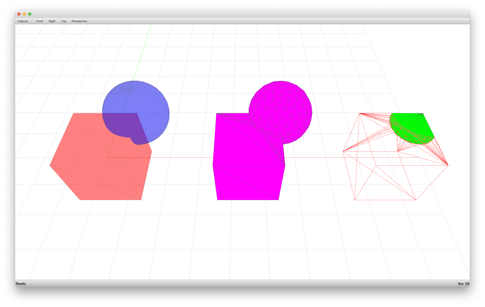

******************
Mesh Booleans CGAL
******************

.. sectionauthor:: tom van mele <van.mele@arch.ethz.ch>

.. rst-class:: lead

    Create compound shapes from basic geometric primitives using boolean operations.

.. literalinclude:: script.py
   :language: python
   :linenos:
